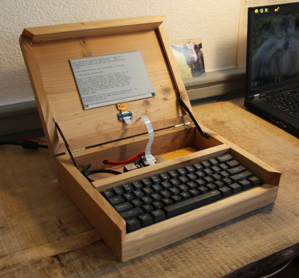

Ultimate Writer
========



Ultimate writer is an attempt to create the perfect digital writing device; it may also be a clickbaity name, who knows.

It was built upon the following principles: 

- **Easily readable e-ink screen**. You can read it effortlessly even in sunlight.
- **Long lasting battery life**. You can have a 3 days writing retreat (~20 hours) without recharging it.
- **Easily serviceable design**. Your typewriter is 40 years old and works just fine. You don't want to change your writing device every 5 years. You want to be able to easily change the computer parts easily; and who knows, use something else than a raspberry pi.
- **Standard OS**. You want to use your favorite console-based text editor. You also want a shell access to tweak your setup without reprogramming the device.
- **Nice full-size mechanical keyboard**.

My ultimate writing device is probably not your ultimate writing device. However, I think we can share a common codebase. 

This repo is hosting this codebase.

## Part List

- A Raspberry Pi. Tested on 3B but should work as well on previous iterations (~40€)
- A Raspberry Pi compatible E-Ink screen. We mainly targeted waveshare/good display 7.5" and 4.2" screens so far. (~40€) **/!\ We did not manage to implement partial refresh on the 7.5" screen so far. The refresh rate on this screen is REALLY slow.**
- A 61 keys Mechanical Keyboard. (Chinese bootlegs are ~70€)
- A generic 3.7V 2500mah phone battery. (~10€)
- Battery charger/regulator. We use the [Adafruit powerboost 500c](https://www.adafruit.com/product/1944). If you live in the EU, you should probably buy it from a local reseller to avoid import taxes. [Pimoroni](https://shop.pimoroni.com/products/powerboost-500-charger-rechargeable-5v-lipo-usb-boost-500ma) is quite nice (unpaid endorsement, plz Pimoroni, send free stuff!). You can probably find some cheaper Chinese bootlegs. (~15€)
- Materials to make the case. (Can't really say a price here, depends a lot of the kind of wood you'll use).
- Intense procrastination. (free)

Depending on where you buy those part and how much time you spend sourcing them, the final price tag will range between 100 and 200€ (half the price of a freewrite.

## Build and Install

First, [install raspbian](https://www.raspberrypi.org/downloads/raspbian/) on your raspberrypi.

Then, install the necessary dependencies:

1. Download and install [bcm2835](http://www.airspayce.com/mikem/bcm2835/).
1. [Enable SPI](https://www.raspberrypi-spy.co.uk/2014/08/enabling-the-spi-interface-on-the-raspberry-pi/) on your raspberry pi.
1. Build and Install [logkeys](https://github.com/kernc/logkeys/blob/master/INSTALL).

Then, open a terminal on the raspberry pi and build ultimate writer:

```
sudo apt-get install build-essential git
git clone $GITHUB_URL && cd ultimate-writer 
make
sudo make install
```

**Note:** The current master branch could be broken, please, use the latest release tag.

If, for some reason, you want to uninstall this software:

```
sudo make uninstall
```

You can then start the ultimate writer service. This service will display a root shell on the e-ink screen: 

```
sudo systemctl start ultimatewriter
```

If you want the service to automatically start on boot:

```
sudo systemctl enable ultimatewriter
```

## Troubleshooting

Open an issue on this GitHub repo.


## Contributing

Contributions are more than welcome.

If you build one of these, it'll make me very happy to see your finished work, send me an e-mail :).

If enough people build this kind of device, we'll create a website listing the various case designs.

In order to contribute:

1. Open a GitHub issue.
1. Fork the project.
1. Send a PR to this repo's master branch.

## Roadmap

This project is not fully done yet, we would like to implement:

- UTF-8 support.
- 7.5" screen partial refresh.
- Get rid of Logkeys by parsing directly /dev/input events and applying the appropriate keymap.
- Run the terminal emulator in an unprivileged environment.
- Get a more reproducible case design (custom keyboard, integrated board design?). 
- Build and sell a small batch of these?

## Special Thanks

- [Suckless team](https://suckless.org): we use a hacked version of [ST](https://st.suckless.org/) for terminal emulation. (Note: the Suckless team do not endorse nor is related to this project, we just like their work)
- [Freewrite](https://getfreewrite.com/): one of the major inspirations for this project. Almost perfect, too bad it is that closed and expensive.
